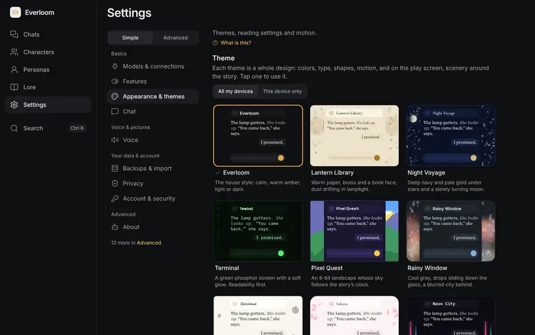
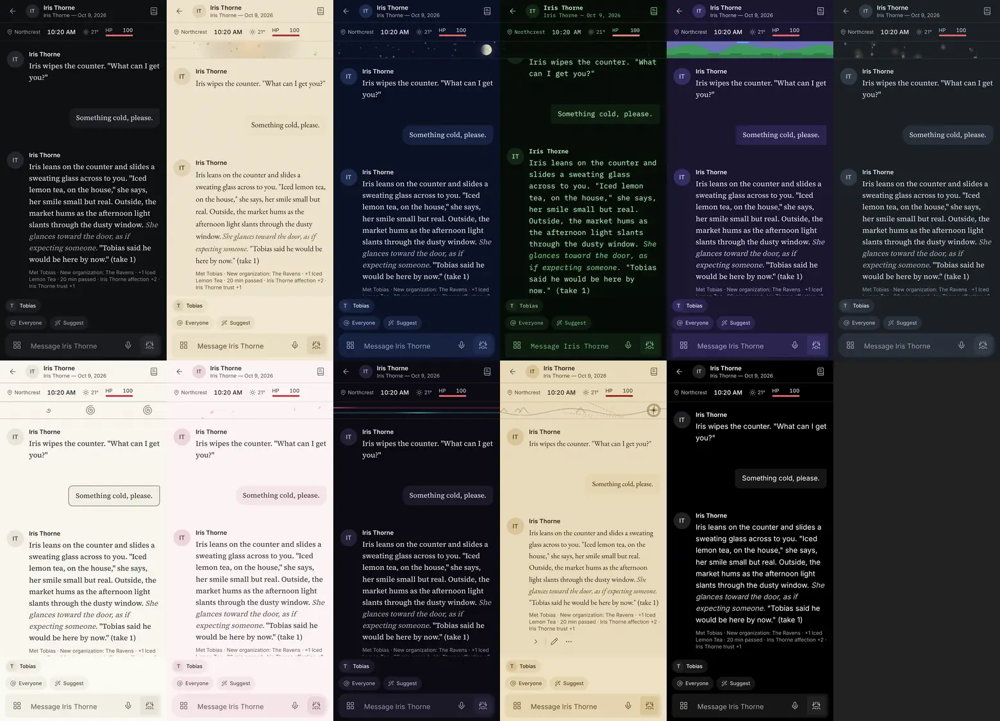
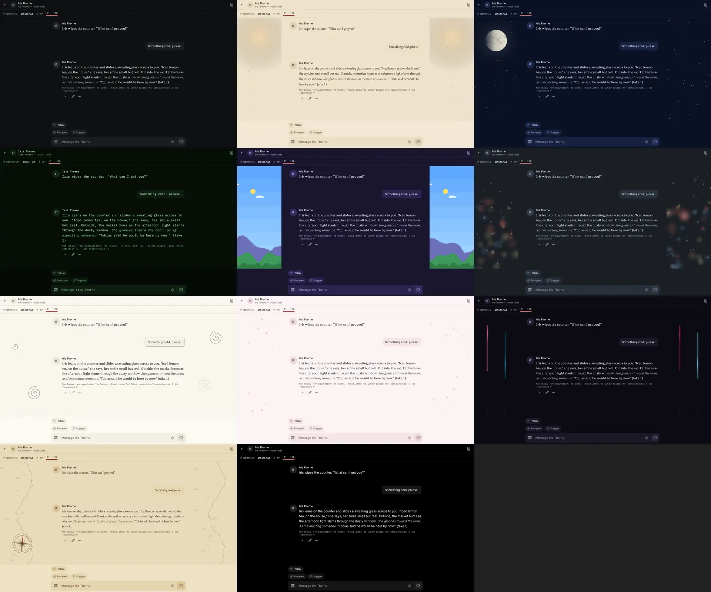
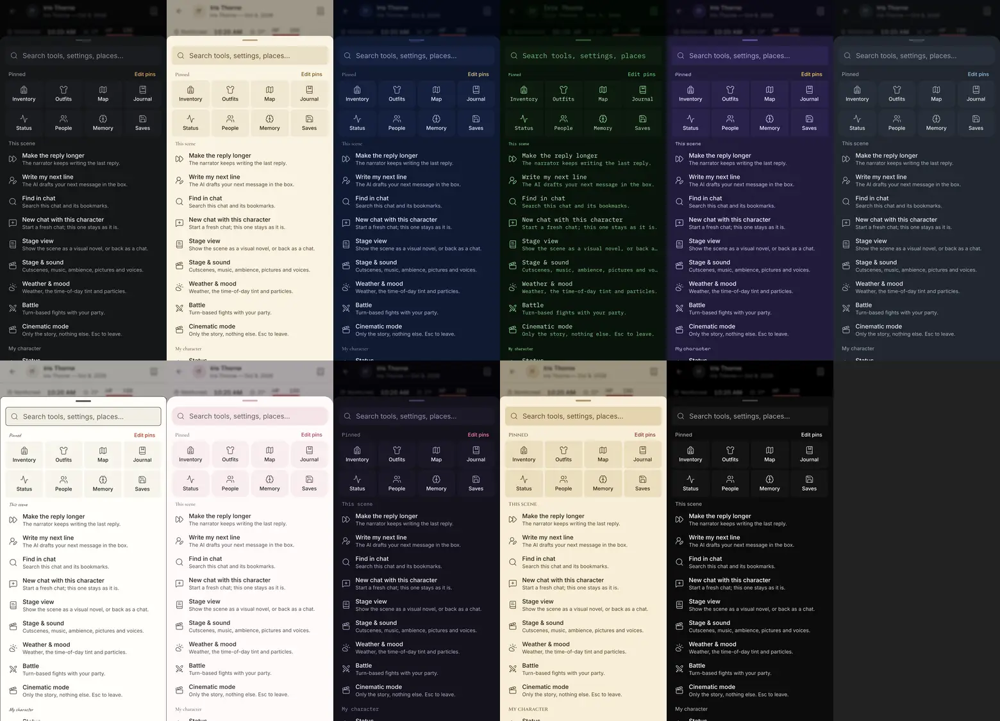
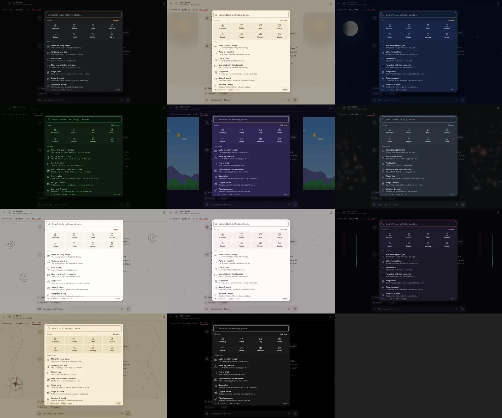
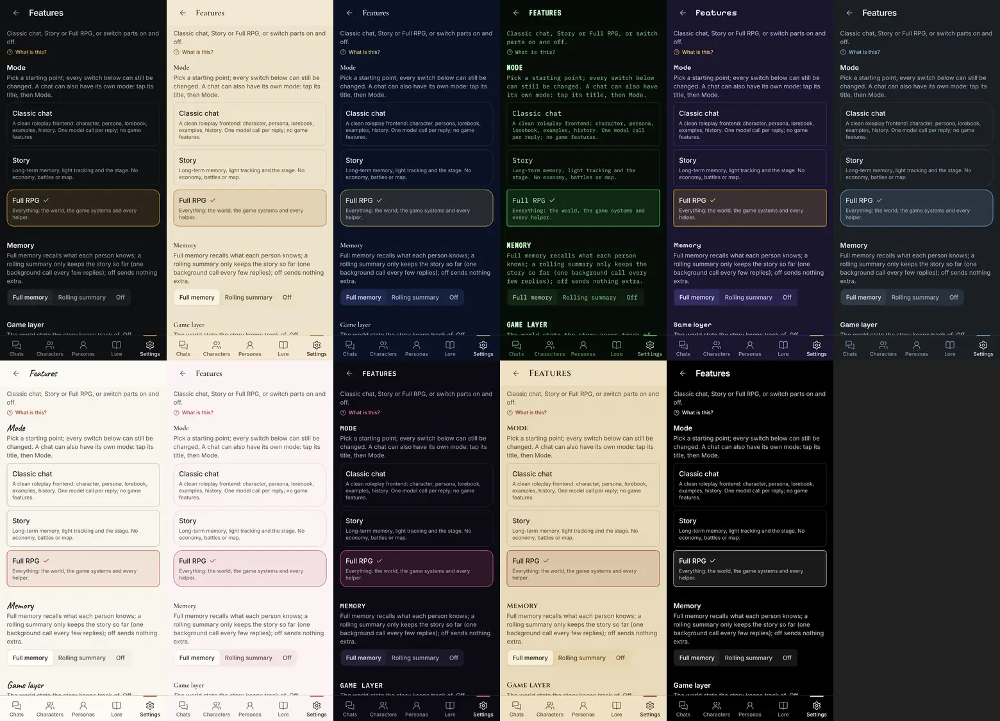
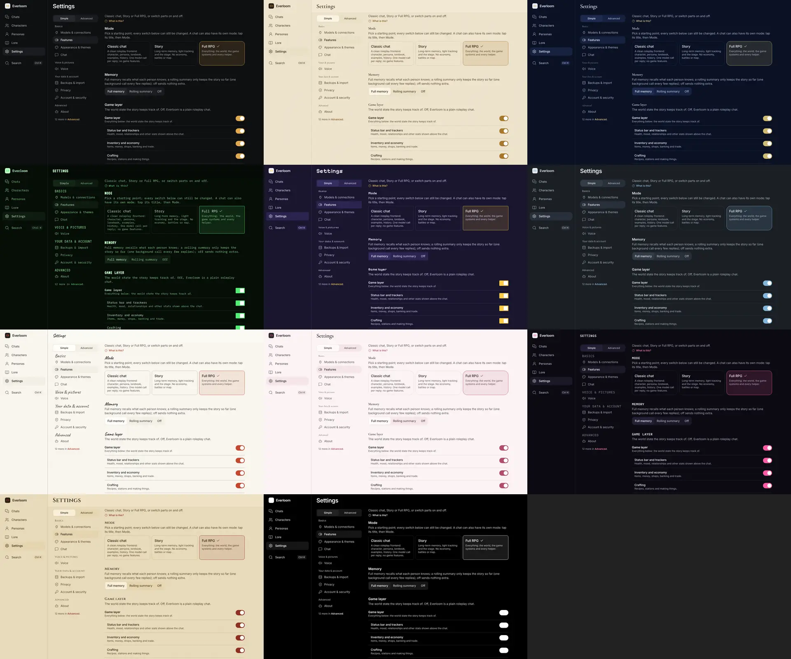
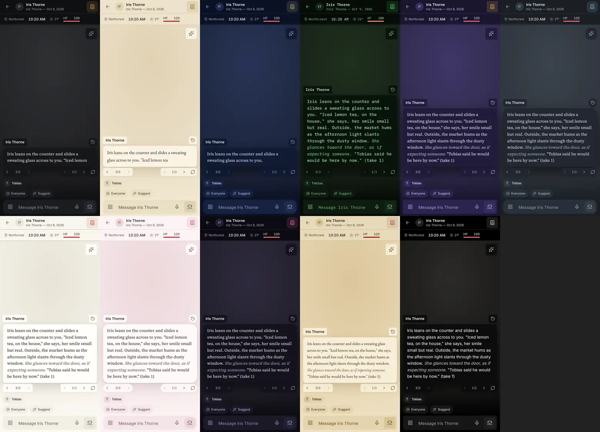
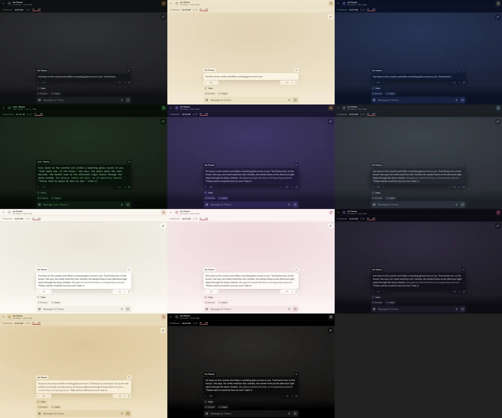

# Themes

A theme is a complete design, not an accent color: its own colors (light, dark or both), fonts,
shapes, a motion style, a texture, a typing indicator and, on the play screen, **scenery** drawn
around the story. Players pick one from a gallery of live previews in **Settings › Appearance &
themes**.

## The eleven themes

| Theme | Light/dark | Story · headings | Shape · motion | Scenery |
|---|---|---|---|---|
| **Everloom** (the default) | both, with the four accent palettes | Source Serif · Inter | soft corners · soft | none |
| **Lantern Library** | light: warm paper, brass | EB Garamond · Cormorant Garamond | small corners · soft | a lamp's pool of light with dust motes drifting up; a quill writes while the AI does |
| **Night Voyage** | dark: deep navy, pale gold | Source Serif · Cormorant Garamond | soft · soft | a twinkling starfield, a moon that turns once every minute and a half, a shooting star now and then |
| **Terminal** | dark: green phosphor | IBM Plex Mono · VT323 | square · snappy | quiet readouts scrolling in the margins, a blinking block cursor; a soft glow on the text; scanlines in the background only |
| **Pixel Quest** | dark: dusk purple, gold | Source Serif · Pixelify Sans (headings only) | pixel corners · playful, pushable buttons | an 8-bit landscape whose sky, sun and moon follow the story's clock |
| **Rainy Window** | dark: cool grey | Source Serif · Inter | round · soft | drops that stick and slide down the glass, a blurred city's lights behind |
| **Sketchbook** | light: off-white paper, ink | Source Serif · Caveat | ink-line borders · playful, pushable buttons | doodles (a star, a spiral, a leaf, a house, a cloud) that draw themselves and fade |
| **Sakura** | light: soft pink, charcoal | Source Serif · Cormorant Garamond | round · soft | petals drifting and turning in the margins |
| **Neon City** | dark: one magenta neon | Source Serif · IBM Plex Mono | medium · snappy | neon tubes with light running along them, their reflections rippling on a wet street |
| **Parchment Quest** | light: parchment, sealing-wax red | EB Garamond · Cinzel | small · soft | a map's coastline, mountains and a dotted route, a compass rose turning slowly |
| **Minimal** | both: pure black and white | Inter · Inter | small · snappy | none |

Every theme works on the story, the Tools palette, settings and the stage:

| | Phone | Desktop |
|---|---|---|
| Story |  |  |
| Tools |  |  |
| Settings |  |  |
| Stage |  |  |

(Order in each sheet: Everloom, Lantern Library, Night Voyage, Terminal, Pixel Quest, Rainy Window,
Sketchbook, Sakura, Neon City, Parchment Quest, Minimal.)

## Contrast

Every theme in every scheme passes WCAG AA (4.5:1) for its text on the surfaces it sits on: body
text, secondary and tertiary text on the page and on cards, accent text on the page, cards and
accent-tinted rows, button text on the accent, and error text. `apps/web/test/looks.test.ts` checks
all fourteen theme/scheme pairs on every run, and that the base tokens in `looks.ts` match
`app.css`.

## How it works

- `apps/web/src/themes/looks.ts` describes each theme as data. At start-up it becomes one
  stylesheet: the theme's tokens, fonts (`--font-ui`, `--font-story`, `--font-heading`), radii,
  motion (`--ui-dur`, `--ui-ease`, `--press`) and texture, scoped to `[data-look]`. Because the
  scope is an attribute, the gallery's previews are real renders: each preview is a small play
  screen with `data-look` and `data-theme` on it.
- A one-scheme theme (Night Voyage is always dark) switches the page to its scheme; "Light or dark"
  applies to Everloom and Minimal.
- The theme in force is: this world's own theme (a chat's **This chat › Theme for this world**),
  unless this device ignores world themes; then this device's override (**This device only** in
  the gallery); then the account's choice. The last one is cached so the first paint already has
  the right background (`public/theme-init.js`).
- Fonts are self-hosted (Fontsource, OFL-1.1 except Special Elite, Apache-2.0; see CREDITS.md). The
  browser downloads a font only when a theme uses it.

## Scenery

- Drawn with canvas 2D (`themes/scenery`), in the margins beside the story column on a wide screen,
  clipped so nothing is ever drawn under the text; on a phone (under 768 px) a 40 px band at the top
  of the story instead. Nothing draws when a margin is too narrow, in cinematic mode, or in stage
  view (the stage is its own scenery).
- **Animated, still or off** (Settings › Appearance & themes › Scenery), with an optional different
  choice for this device.
- It **pauses** when the tab is hidden, when it is scrolled off screen, and while you type on a
  phone; under reduced motion (the device's or Everloom's own setting) it draws one still frame.
  `tests/ux/themes.spec.ts` checks that no frames are drawn while hidden or under reduced motion.
- Frame rates are capped (15 fps on a wide screen, 10 on a phone's band, 10–12 for Pixel Quest and
  Terminal), glows are drawn once into small sprites, and the canvas is its own compositor layer.

## Performance

Measured by `tests/ux/scenery.spec.ts` in Chromium with the CPU slowed 4× (Chrome's mid-tier mobile
setting), comparing each theme with scenery on and with scenery off, over six seconds
([phone](evidence/scenery-cpu-phone.json), [desktop](evidence/scenery-cpu-desktop.json)).

| Theme | Phone: scene script | Phone: all main-thread work | Desktop: scene script | Desktop: all main-thread work |
|---|---|---|---|---|
| Lantern Library | 0.5% | 4.8% | 1.0% | 18.6% |
| Night Voyage | 0.9% | 6.4% | 2.3% | 16.6% |
| Terminal | 0.9% | 2.8% | 3.3% | 10.9% |
| Pixel Quest | 1.0% | 5.1% | 0.9% | 11.2% |
| Rainy Window | 0.6% | 5.6% | 1.3% | 20.1% |
| Sketchbook | 0.6% | 4.2% | 0.7% | 11.8% |
| Sakura | 0.6% | 4.5% | 1.1% | 12.2% |
| Neon City | 0.5% | 3.3% | 1.3% | 10.0% |
| Parchment Quest | 0.5% | 6.0% | 0.8% | 17.5% |

*Scene script* is the time spent drawing scenes, as a share of one slowed core. *All main-thread
work* also counts what Chromium does to show each frame; the test machine has no GPU, so here that
includes compositing in software, which a phone does on its GPU. These are the numbers from the
latest run (the JSON files are updated by each run); the test fails if a scene's script goes over 2%
on a phone (4% on desktop) or all main-thread work over 10% on a phone.

On a desktop the margins are large (two canvases' worth of a 1280×800 window) and, without a GPU,
compositing them in software costs 10–20% of a *slowed* core; a desktop runs at full speed with a
GPU, and scenery can be set to still or off per device. Not measured: a real phone's GPU, which
this environment doesn't have.

## Reading settings

Next to the gallery: story text size (four steps), line spacing, column width, the space between
paragraphs, and the story and interface fonts (each "the theme's" by default). They are variables
on the page (`--story-leading`, `--story-width`, `--story-paragraph`, `--font-story`, `--font-ui`),
so every theme follows them.

## Micro-interactions

Per theme, in `themes/interactions.css`, transform and opacity only, within the theme's own
duration (140–220 ms) and cut short by reduced motion:

- **Typing indicator**: three dots (Everloom, Minimal), a quill writing a line (Lantern Library,
  Parchment Quest), a blinking block cursor (Terminal), stepping blocks (Pixel Quest), falling drops
  (Rainy Window), turning petals (Sakura), twinkling stars (Night Voyage), a neon pulse (Neon City),
  wiggling pencil marks (Sketchbook).
- **A message arriving** rises into place (soft), just fades (Terminal) or rises with a little give
  (playful).
- **Buttons and switches**: the press depth follows the motion style; Pixel Quest and Sketchbook
  have pushable primary buttons (adapted from uiverse.io, by Voxybuns); Terminal and Pixel Quest
  switches are square; Neon City's primary button glows.
- **Success burst**: a ring of light around the new level in the level-up moment.
